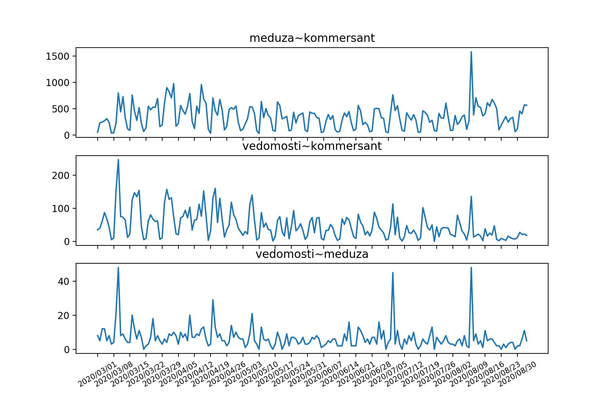
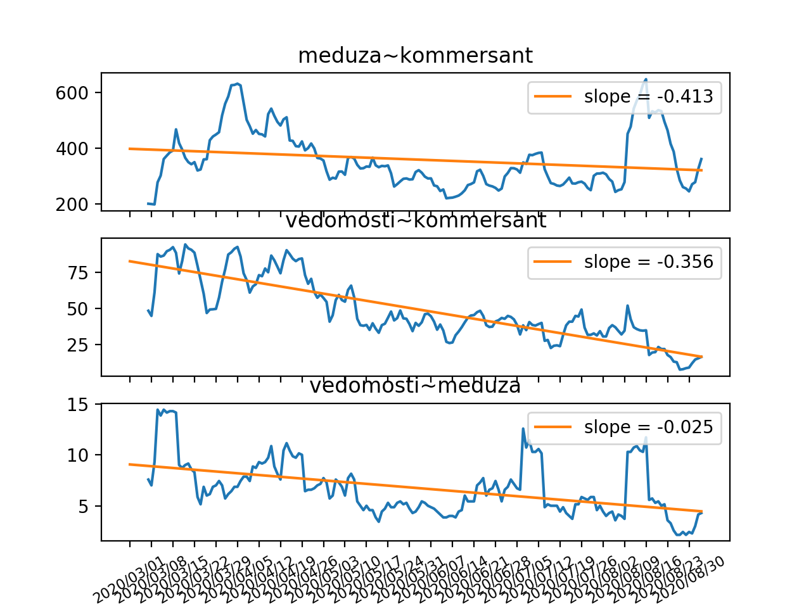

## About
<!-- This project was created to compare articles /
 
 * Analyse articles is a project that compares russian newspapers 
similarity among their daily articles. 

The project tries to find implicit similarities between russian
online newspapers.
 
 -->
In this project we examine 3 russian online newspapers: Vedomosti, Kommersant, and Meduza. 
 The idea of this project was initiated on March 24 2020 when the Editor in Chief of Vedomosti was 
 replaced by a pro-governmental one. Soon enough the journalists working in the newspaper started complaning 
 on the new Editor in Chief to censor part of the news and even editing the recent ones. We wanted to 
 see how much the direction of news in Vedomosti might change over time, so we decided to compare it 
 with a pro-governmental Kommersant and liberal Meduza. 
 
 To compare articles in newspapers a `word2vec` model for 
russian language (`word2vec-ruscorpora-300`) is used. This repository includes
a set of functions to:
* download articles from newspapers
* add tags to articles and convert them into vectors
* compare vector similarity
* draw the plot with the result


 ### Word2Vec
 A `word2vec` model used in this project was implemented by [RusVectōrēs](https://rusvectores.org/en/about/) team.
 Please check out their page and [git](https://github.com/akutuzov/webvectors) for more information.
 
 
## Installation

To setup the project, first install all the dependencies and then clone the repo.

### Dependencies 

Project is written in Python 3.7 

A number of libraries for working with web-content are used.  
To install all the necessary dependencies needed to **download articles** please run: 
```
pip install beautifulsoup4
pip install selenium
pip install newspaper3k
pip install requests
pip install DateTime
```
    
To setup the **word2vec model**, run: 
```
pip install gensim
```
the following piece of code is included in the project 
and therefore the necessary `word2vec` model will be downloaded _automatically_ (if no present) 
```
import gensim.downloader as api

# Get information about the model or dataset
api.info('word2vec-ruscorpora-300')
# Download model
w2v_model = api.load("word2vec-ruscorpora-300")
```

To **add part-of-speech tags** to articles a few util libraries were used, to get all necessary dependencies install:  
```
pip install ufal.udpipe
pip install numpy
pip install wget
```

Finally, to **draw the plot** and **calculate the trend** in the number of similar articles (the standard) libraries `matplotlib` and `statmodels` are required
```
pip install matplotlib
pip install statsmodels
```

### Run the project 
This section shows how to reproduce the results presented at the end.

First, clone the repo using 
```
git clone https://github.com/Julia117/analyze_articles.git
```

#### Setup the dates 
Next, we need to set a period of time to analyze articles for. To do so we need to set `date_start` and `date_end` as `datetime.date()`. 
For example, to set `date_start` for June 1 and `date_end` for September 1 we use:
```
date_start = datetime.date(2020, 6, 1)
date_end = datetime.date(2020, 9, 1)
```
then we need to update the time period:
```
period = util_functions.date_range(date_start, date_end)
```

#### main.py
Now we can start gathering the data. First, we need articles' links to start with. 
All the data will be saved on the disk. We get the links in format 
`{date : list of links}` using:
```
URLS_MEDUZA = "analyze_articles/urls_meduza.txt"
URLS_VEDOMOSTI = "analyze_articles/urls_vedomosti.txt"
URLS_KOMMERSANT = "analyze_articles/urls_kommersant.txt"

urls_v = get_links.get_links_for_period(period, get_links.get_links_for_date_vedomosti, URLS_VEDOMOSTI)
urls_k = get_links.get_links_for_period(period, get_links.get_links_for_date_kommersant, URLS_KOMMERSANT)
urls_m = get_links.get_links_for_period_meduza(period, URLS_MEDUZA)
``` 

Now we can collect articles' texts using the links we already have
```
TEXTS_MEDUZA = "analyze_articles/texts_meduza.txt"
TEXTS_VEDOMOSTI = "analyze_articles/texts_vedomosti.txt"
TEXTS_KOMMERSANT = "analyze_articles/texts_kommersant.txt"

articles_m = get_articles.get_articles_for_period(urls_m, TEXTS_MEDUZA, period)
articles_v = get_articles.get_articles_for_period(urls_v, TEXTS_VEDOMOSTI, period)
articles_k = get_articles.get_articles_for_period(urls_k, TEXTS_KOMMERSANT, period)
```

Having downloaded all the necessary data, we are ready to start processing. To convert texts to vectors we need
to add part-of speech tags to them. Example: `"кот" (cat)` is transformed to  `"кот_NOUN".`

```
TAGGED_MEDUZA = "analyze_articles/tagged_meduza.txt"
TAGGED_VEDOMOSTI = "analyze_articles/tagged_vedomosti.txt"
TAGGED_KOMMERSANT = "analyze_articles/tagged_kommersant.txt"

tagged_m = add_tags.add_tags_to_articles(articles_m, TAGGED_MEDUZA, period)
tagged_v = add_tags.add_tags_to_articles(articles_v, TAGGED_VEDOMOSTI, period)
tagged_k = add_tags.add_tags_to_articles(articles_k, TAGGED_KOMMERSANT, period)
```

Now we are ready to get vectors from texts. 
```
vectors_m = file_handling.read_from_file(VECTORS_MEDUZA)
vectors_k = file_handling.read_from_file(VECTORS_KOMMERSANT)
vectors_v = file_handling.read_from_file(VECTORS_VEDOMOSTI)
```
As a result we have data in the following format: `{date : list of vectors}`,
where a vector corresponds to an article text for a chosen date. 

#### Download processed data
For it takes very long to download and process articles, all the necessary data for the period from
March 1 2020 to September 3 2020 can be found [on this google disk page.](https://drive.google.com/file/d/164tFT6V08AXadfXRGh8qTzrCnGgWMkwH/view?usp=sharing)
It contains the links, articles' texts, tagged articles, and vectors for each article.   
An example of how one can load data from disk (similarly for texts, tags, and vectors):
```
URLS_MEDUZA = "analyze_articles/urls_meduza.txt"
urls_m = file_handling.read_from_file(URLS_MEDUZA)
```


<!-- 
#### How to download articles (without analyzing) 
--> 
 


 
 ### Results
  
 Here are the results we've got.
  
  The first plot represents number of pairs of similar articles 
 between two newspapers. The dates are on x-axis, number of pairs of similar articles are on y-axis:
 
 
 We see three most noticeable peaks here. They are:
   * [Putin's speach on changing the constitution](https://www.theguardian.com/world/2020/mar/10/vladimir-putin-amendment-power-russia-2024)
   * [A journalist arrested for treason](https://edition.cnn.com/2020/07/08/europe/russia-roscosmos-ivan-safronov-arrest-treason-intl/index.html)
   * [President elections in Belarus](https://www.bbc.com/news/world-europe-53717834)
   
 The second plot represents a trend of number of similar pairs between the newspapers and the regression
 lines:
 

As we can see on the second plot, the relation between Vedomosti and Meduza stays pretty much the same,
while both Meduza and Vedomosti shared more news themes in March and April, after that the trends go down.
We may assume that it was due to the explosion of COVID-19 in Europe, therefore we cannot say
that Vedomosti changed their direction.